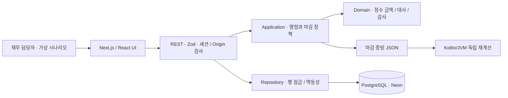

# ClosePilot

[](https://github.com/kwakhyun/closepilot/actions/workflows/verify.yml)

**주문·정산 대사부터 검토와 마감 증빙까지.**

K-브랜드 재무 담당자가 주문과 정산 자료의 차이를 확인하고, 검토 근거를 남기고, 확정한 결과를 다시 검증할 수 있도록 만든 매출 마감 도구입니다. **대사**는 주문 자료와 정산 자료를 대조해 일치 여부를 확인하는 작업을 뜻합니다.

[공개 데모](https://closepilot-delta.vercel.app) · [제품 가이드](https://closepilot-delta.vercel.app/guide) · [설계 기록](docs/architecture.md) · [검증 근거](docs/verification.md)


> PortOne Commerce Ops Product Engineer 지원을 위해 기획·설계·구현·검증·배포한 개인 포트폴리오입니다. PortOne 공식 제품이나 제휴 서비스가 아닙니다. 브랜드·주문·수수료율은 모두 가상입니다. 고객 인터뷰나 도입 성과 측정은 진행하지 않았으며, 실제 결제·송금 기능은 제공하지 않습니다. 검토 가이드는 **규칙 기반이며 LLM을 호출하지 않습니다.**

## 왜 이 문제인가

월 마감에서 합계를 맞추는 것만큼 **“왜 금액이 다르고, 어떤 근거로 검토했는지”를 설명하는 일**이 중요하다고 가정했습니다. 채널마다 다른 CSV를 가져와 부분 환불, 수수료 차이, 중복 정산, 입금 확인이 필요한 거래를 한 화면에서 검토하는 범위로 문제를 좁혔습니다.

가상의 K-Beauty 브랜드 **LUMIÈRE**가 자사몰·스마트스토어·쿠팡에서 판매하는 상황을 설정하고 주문·정산 샘플을 직접 만들었습니다. 실제 채널의 내보내기 형식을 그대로 재현한 자료는 아닙니다. 고객에게 확인할 질문과 도입 시 점검할 항목은 [제품 기획서](docs/product-brief.md)에 정리했습니다.

| 지원 직무의 기대               | 이 프로젝트에서 확인할 수 있는 작업                                        |
| ------------------------------ | -------------------------------------------------------------------------- |
| 모호한 운영 문제 정의          | 가설, 인터뷰 질문, 입력 규칙, 완료 기준, 남은 위험 정리                    |
| 온보딩부터 구현·배포까지 수행  | CSV 열 연결·미리보기 → 일괄 반영 → 대사 → 검토 → 마감 → Vercel 배포        |
| 타입으로 도메인 복잡도 통제    | TypeScript 경계 검증, 정수 KRW 연산, Kotlin 값 클래스·sealed 결과 타입     |
| 재사용 가능한 기능과 개발 자산 | CSV 어댑터, 순수 대사 함수, 명령 처리기, 독립 검증기, 고정 검증 데이터     |
| 운영을 고려한 설계             | 중복 요청·동시 수정 방지, DB 잠금, 감사 기록, 오류 추적, 운영 가이드       |
| AI를 개발 과정에 통합          | Codex로 구현·검증하고, 에이전트 지침·커밋 훅·CI로 변경 시 지킬 기준을 관리 |

## 3분 체험

1. 대시보드에서 **128건 중 일치 120건, 확인 필요 8건**을 확인합니다.
2. `LM-2608045` 중복 정산 거래를 엽니다. 연결된 정산 내역 두 행을 펼쳐 예상 정산액과 자료상 정산액을 비교합니다.
3. **검토 예시 불러오기**를 누르고, 원본 자료와 사유를 확인한 뒤 체크하고 승인합니다. 미검토 건수는 줄지만 원본 금액과 자동 일치율은 변하지 않습니다.
4. **자료 가져오기**에서 주문·정산 샘플을 각각 미리 보고 **자료 반영**을 누릅니다. 새 자료를 반영하면 대사를 다시 실행해야 검토를 승인할 수 있습니다.
5. 나머지 예외 거래를 검토한 뒤 **마감 점검 → 8월 마감 확정**을 실행합니다. 마감 증빙 파일(JSON)을 내려받아 Kotlin 검증기로 다시 계산할 수 있습니다.

방문자마다 6시간 동안 이용할 수 있는 별도의 데모 세션이 생성됩니다. 실제 거래 자료나 개인정보를 올리지 마세요. [자세한 시연 순서](docs/demo-script.md)

## 구현한 핵심

### 1. 원본 금액을 유지하는 대사

`(channel, orderId)`로 주문과 정산을 연결합니다. 금액은 원 단위 정수, 수수료율은 1bp = 0.01% 단위로 처리합니다. 수수료는 **환불액을 차감한 금액에 요율을 적용한 뒤 주문별로 반올림**합니다. 같은 채널의 정산번호가 중복되어도 원본 행을 자동으로 삭제하지 않습니다.

정산 누락, 주문 미확인, 중복 정산, 환불액 차이, 수수료 차이, 금액 차이, 입금 확인 필요의 **7개 예외 유형**을 지원합니다. 여러 조건이 겹치면 정해진 우선순위에 따라 대표 유형 하나를 표시하며, 모든 정산 행을 보존합니다. 화면의 **자료상 정산액**은 정산 파일에 기록된 금액으로, 은행 계좌에 실제로 입금된 금액을 확인한 결과가 아닙니다.

### 2. 검토 근거와 변경 기록을 함께 저장

`import → reconcile → resolve → close`를 명령으로 처리합니다. `expectedVersion`, `SELECT ... FOR UPDATE`, `Idempotency-Key`를 함께 사용합니다. 상태, 검토 기록, 감사 이벤트, 요청 처리 이력(receipt)을 하나의 트랜잭션에 저장합니다.

검토 승인은 사유와 증빙 참조 정보를 남기는 기능입니다. 금액을 보정하거나 회계 전표를 만들지 않습니다. 원본이 바뀌면 해당 대사 결과의 식별 해시(fingerprint)가 달라져 이전 승인을 그대로 사용할 수 없습니다. 마감 후에는 API와 DB 트리거 모두 수정 요청을 거부합니다.

### 3. Kotlin으로 독립 재검증

[Kotlin/JVM 모듈](verifier)은 내보낸 마감 증빙의 주문·정산 입력으로 대사를 다시 수행합니다. 웹에서 계산한 결과와 행별 금액·분류·합계를 비교하고, 검토 근거와 감사 기록의 해시를 검사합니다.

`Won`, `BasisPoints`, `OrderKey` 값 객체와 `Reconciliation` sealed 타입으로 금액과 대사 결과를 표현합니다. 금액 계산에는 `Long`과 `BigInteger`를 사용합니다. **웹 백엔드는 TypeScript/Next.js이며, Kotlin은 별도의 오프라인 검증 CLI입니다.**

### 4. 온보딩과 운영까지 연결

CSV의 BOM·줄바꿈·따옴표 처리, 한글·영문 열 연결, 숫자·날짜·기간 검증, 파일 중복 방지, 입력 한도, CSV 수식 주입 방어를 구현했습니다. 상태는 PostgreSQL에 저장합니다. 공개 배포 환경에서 DB 설정이 빠지면 오류를 반환하며, 임시 메모리 저장소로 대체하지 않습니다.

## 구조와 기술 선택



| 영역      | 선택                                                                   |
| --------- | ---------------------------------------------------------------------- |
| 웹/REST   | Next.js 16, React 19, TypeScript strict, Zod                           |
| 도메인    | 프레임워크에 의존하지 않는 대사 함수, 레이어 경계 검사                 |
| DB        | 운영: Neon PostgreSQL / 로컬: PGlite / CI: PostgreSQL 17               |
| 독립 검증 | Kotlin 2.4.10, JVM 21, Gradle Wrapper 9.4.1                            |
| UI        | 자체 CSS, Pretendard, Lucide, 반응형 화면·키보드 대화상자              |
| 검증/배포 | Vitest, 실제 HTTP 검증 스크립트, Kotlin 테스트, GitHub Actions, Vercel |

데모의 배포와 운영을 단순하게 유지하기 위해 TypeScript 웹 런타임을 선택했습니다. 한 세션의 마감 데이터를 하나의 일관성 단위(aggregate)로 묶어 JSONB에 저장합니다. 대규모 거래를 처리하려면 테이블 정규화, 비동기 작업, 별도 마이그레이션 실행 절차가 필요합니다. [설계와 대안](docs/architecture.md) · [ADR](docs/adr/0001-runtime-and-scope.md)

## 데이터와 검증

아래 수치는 **의도적으로 만든 고정 샘플의 결과**입니다. 업무 시간 절감, 실제 자동화율, 실서비스 성능을 측정한 값이 아닙니다.

| 고정 샘플                    |          값 |
| ---------------------------- | ----------: |
| 주문 / 정산 행               |   128 / 127 |
| 자동 일치 / 예외 거래        |     120 / 8 |
| 일치율                       |       93.8% |
| 주문 총액                    | ₩17,072,000 |
| 예상 정산액                  | ₩16,072,966 |
| 예외 거래 차액의 절댓값 합계 |    ₩358,281 |

예외 8건은 정산 누락 2건, 수수료 차이 2건, 환불액 차이 1건, 중복 정산 1건, 입금 확인 필요 2건입니다. 입금 확인이 필요한 2건은 차액이 0원이지만, 정산 자료의 입금일이 비어 있거나 마감 기준일 이후입니다. 차액의 절댓값 합계는 순차액이나 실제 회수할 수 있는 금액을 뜻하지 않습니다.

- TypeScript **77개 테스트**: 금액, CSV, 도메인 상태, HTTP 보안, DB 트랜잭션·동시성·세션 격리.
- Kotlin **6개 테스트**: 고정 패키지 재계산, 중복, 체크섬·계산값·감사 기록 변조 거부.
- HTTP **20개 검증 단계**: 실제 서버에서 세션 생성부터 CSV 반영·예외 승인·마감·내보내기까지.
- [GitHub Actions 실행](https://github.com/kwakhyun/closepilot/actions/runs/33348712211): PostgreSQL 17 웹 검증과 JDK 21 Kotlin 검증 모두 통과.
- 브라우저 확인과 배포 결과는 [검증 기록](docs/verification.md)에 환경과 한계를 함께 기록합니다.

## 로컬 실행

Node.js 24를 기준으로 검증했습니다. **웹 데모만 로컬에서 실행할 때는 DB 계정이나 API 키가 필요 없습니다.**

```bash
npm ci
npm run dev
# http://localhost:3000
```

`DATABASE_URL`이 없으면 `.data/closepilot`에 PGlite 데이터를 저장합니다. PostgreSQL 사용 시 `.env.example`을 참고해 서버 환경 변수로 연결 문자열을 설정하세요. 브라우저 코드에 비밀키를 넣지 않습니다.

```bash
npm run verify                     # 레이어 검사, 타입, lint, 77개 테스트, 빌드
npm run fixtures                   # 고정 데이터와 검증 패키지 재생성
npm run smoke -- http://localhost:3000
```

Kotlin 독립 검증에는 JDK 21이 필요합니다. 첫 실행은 Gradle·의존성을 다운로드합니다.

```bash
cd verifier
bash gradlew test run --args='../fixtures/closed-package.json'
# 실제로 내려받은 패키지:
bash gradlew run --args='/absolute/path/to/closepilot-2026-08-close.json'
```

Windows에서는 `JAVA_HOME`을 JDK 21로 설정하고 루트에서 `./scripts/verify-kotlin.ps1`을 실행합니다. 한글 경로에서 Gradle 테스트 작업자의 classpath가 깨지는 문제를 피하도록 임시 ASCII 빌드 경로를 사용합니다.

Docker 설정도 제공합니다: `docker compose up --build`. 이 환경에서는 Docker 실행을 검증하지 않았습니다. GitHub Actions의 웹 검증은 별도의 PostgreSQL 17 서비스에서 실행해 통과했습니다.

## AI 사용과 재현 가능한 개발

이 프로젝트는 **Codex의 도움으로 기획·구현·브라우저 조작·테스트·배포**를 진행했습니다. 생성된 코드를 금융 계산의 근거로 삼지 않고, 명시적인 불변식·고정 입력·독립 Kotlin 재계산으로 확인했습니다.

- [AGENTS.md](AGENTS.md), [CLAUDE.md](CLAUDE.md): 에이전트가 지켜야 할 도메인·보안·검증 지침.
- [레이어 검사](scripts/check-architecture.mjs): 서버 코드를 클라이언트로 가져오거나 도메인에 DB 의존성을 추가하면 실패.
- [pre-commit 훅](.githooks/pre-commit): `git config core.hooksPath .githooks`로 활성화. CI에서도 같은 검증 실행.
- [변경 검토 절차](docs/ai-development.md): 근거 확인 → 제한된 변경 → 반례 검증 → 결과 기록.

공개 제품에 유료 LLM 호출이나 자율 승인 에이전트는 연결하지 않았습니다. 향후 설명 보조에 추가하더라도 금액·승인·마감 권한은 주지 않는 설계를 문서화했습니다.

## 범위와 남은 위험

이 결과물은 **작동하는 포트폴리오 데모**이며 기업용 재무 SaaS의 운영 준비를 마쳤다는 의미가 아닙니다. SSO/RBAC, 작성자·승인자 분리, 실제 채널·은행 연동, 여러 통화 지원, 회계 전표, 외부 감사용 서명·보관, SLA·복구 훈련은 범위에 포함하지 않았습니다. 증빙 참조 정보는 텍스트로 저장하며, 외부 증빙의 진위까지 확인하지는 않습니다.

세션 생성 후 6시간이 지나면 접근이 차단됩니다. 실제 데이터 삭제는 다음 세션을 생성할 때 수행하므로, 정확히 6시간 뒤 삭제되지는 않을 수 있습니다. SHA-256은 내용 변경을 확인하는 체크섬이며 전자서명이나 DB 관리자의 변경을 막는 장치가 아닙니다. [보안 모델](docs/security.md) · [운영 가이드](docs/runbook.md) · [API 명세](docs/openapi.yaml) · [용어와 문구 기준](docs/copy-guide.md)

## 참고 자료와 라이선스

도메인과 통신 설계의 참고 자료: [PortOne V2 REST API](https://developers.portone.io/api/rest-v2), [PortOne 파트너 정산 서비스 가이드](https://help.portone.io/content/partner_settlement_service_guide), [PostgreSQL 행 잠금](https://www.postgresql.org/docs/17/explicit-locking.html), [Next.js Route Handlers](https://nextjs.org/docs/app/getting-started/route-handlers). 실제 서비스 정책을 복제하거나 공식 연동을 주장하지 않습니다.

코드: [MIT](LICENSE). Pretendard: [SIL Open Font License](public/fonts/OFL.txt). 채널명은 시나리오 설명을 위한 표시이며 로고·공식 에셋은 사용하지 않았습니다.
