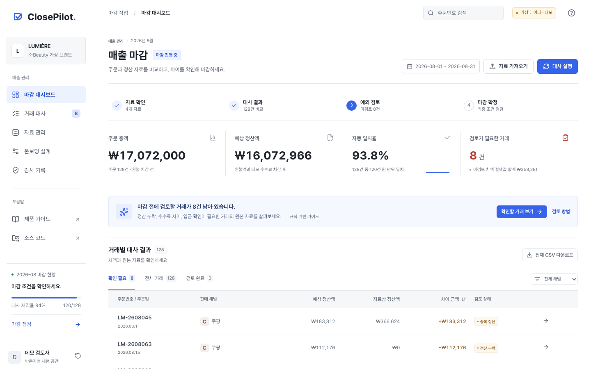
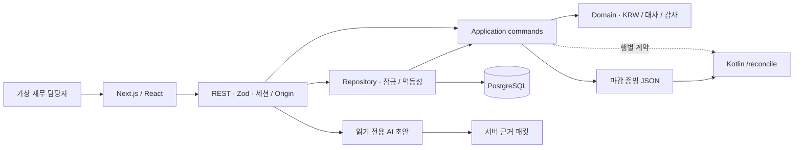

# ClosePilot

[](https://github.com/kwakhyun/closepilot/actions/workflows/verify.yml)

주문 자료와 판매 채널의 정산 자료를 대조해 예외 거래의 검토 근거를 기록하고, 확정한 마감 결과를 보관하는 커머스 매출 마감 도구입니다.

**바로 보기:** [공개 데모](https://closepilot-delta.vercel.app), [완료된 합성 예시](https://closepilot-delta.vercel.app/?showcase=completed), [제품 가이드](https://closepilot-delta.vercel.app/guide)

**문서:** [설계 기록](docs/architecture.md), [검증 근거](docs/verification.md)



[화면 모음](docs/screenshots.md)에서 대시보드, 거래 검토, 월별 작업과 정책 비교 화면을 확인할 수 있습니다.

> 합성 데이터로 매출 마감 과정을 체험하는 공개 데모입니다. 브랜드, 거래, 수수료율은 모두 합성이며 고객 인터뷰나 도입 성과 측정은 진행하지 않았습니다. 실제 결제, 송금, 회계 전표 생성 기능은 없습니다. AI는 저장된 합성 근거로 검토 메모 초안만 만들며 금액을 바꾸거나 거래를 승인하고 마감할 권한이 없습니다.

## 90초 검토 경로

1. [거래 대사 화면](https://closepilot-delta.vercel.app/?view=transactions)에서 `LM-2608045`를 열고 중복된 정산 두 행, 예상 정산액, 자료상 정산액을 비교합니다.
2. **검토 예시 불러오기**를 누르고 원본 확인란을 체크한 뒤 기록합니다. 원본 금액과 자동 일치 결과는 유지되고 사유와 증빙 참조만 저장됩니다.
3. [완료된 합성 예시](https://closepilot-delta.vercel.app/?showcase=completed)에서 읽기 전용 상태, 감사 기록과 마감 증빙 JSON을 확인합니다.

자료 반영부터 모든 예외 거래의 검토와 마감까지 직접 실행하려면 [전체 시연 순서](docs/demo-script.md)를 참고하세요. 작업 세션은 6시간이며 새 작업은 같은 브라우저의 보관함에서 생성일로부터 30일간 다시 열 수 있습니다. 실제 거래 자료나 개인정보는 업로드하지 마세요.

## 주요 기능

1. CSV 반영 전에 거래 수, 예상 정산액, 예외 수와 무효화될 승인을 비교합니다. 잘못된 행은 열 이름과 함께 표시하고 오류 목록을 CSV로 내려받습니다.
2. 검토 메모를 현재 탭에 임시 저장하고 복원하거나 삭제합니다. 복원해도 승인 확인란은 체크하지 않으며, 결과가 바뀌면 재확인을 안내합니다.
3. 거래별 총액, 환불액, 수수료, 중복과 입금일을 각각 진단하고, 예외 유형과 차이 금액으로 검토 대상을 찾습니다.
4. 감사 기록 화면에서 마감 증빙 JSON을 열어 체크섬, 재계산 결과, 검토 근거와 감사 연결을 검사합니다. 최대 12개 파일을 월별로 비교하며 서버에는 저장하지 않습니다.
5. 온보딩 화면에서 채널별 수수료율의 영향을 비교하고, 사유와 근거를 확인해 현재 월 전체에 적용합니다. 적용 후 재대사가 필요하며 결과가 달라진 기존 승인은 무효화됩니다. 확정한 마감은 변경할 수 없습니다.
6. 2020년 1월부터 2035년 12월까지 월을 선택해 같은 브랜드 설정으로 새 합성 작업을 시작합니다. 같은 보관함의 이전 마감에서 이월 검토한 주문과 현재 정산 근거를 연결하고 검토 기록을 남깁니다. 실제 입금 확인이나 금액 자동 이월은 하지 않습니다.

월별 작업 보관함은 같은 브라우저의 쿠키로 접근하며 최대 12개를 보관합니다. 계정 기반 영구 보관함은 아니며 쿠키를 삭제하면 복구할 수 없습니다. 이전 월의 작업과 저장된 열 연결을 다시 열 수 있지만 자동 이월과 회계 처리는 제공하지 않습니다. 검토 목록에서 예외 유형과 최소 차이 금액을 함께 필터링할 수 있습니다. 임시 메모는 같은 탭에서만 복원하며 새로 저장한 시점부터 최대 6시간 동안 유지합니다.

## 핵심 설계

- `(channel, orderId)`를 주문 키로 사용합니다. 수수료는 환불액을 차감한 금액에 프로필 요율을 적용하고 주문별로 반올림합니다.
- 정산 누락, 주문 미확인, 중복, 환불액, 수수료, 금액, 입금 시점의 7가지 예외를 분류하되 모든 원본 행을 보존합니다.
- `import → reconcile → resolve → close`를 명령으로 처리합니다. 새 자료는 재대사 전에 승인할 수 없고, 결과 식별값(fingerprint)이 바뀌면 이전 승인도 무효가 됩니다.
- 상태와 감사 이벤트, 요청 처리 기록(receipt)은 한 트랜잭션에 저장합니다. 확정 후 변경은 애플리케이션과 DB 트리거가 함께 거부합니다.
- CSV 반영 전에는 전체 합계와 차액의 절댓값 합계도 검사합니다. 1조 원 한도를 넘으면 자료, 열 연결, 감사 기록과 요청 처리 기록을 모두 저장하지 않습니다.
- 설정 복제는 현재 세션에 저장한 열 연결과 정책을 서버에서 읽어 새 작업공간으로 복사합니다. 원본 버전이 바뀌거나 세션이 만료되면 복제를 거부합니다.
- Kotlin `/reconcile` 응답은 TypeScript가 만든 행별 계약 검증 데이터와 비교하고, `/verify`는 마감 패키지의 계산값과 감사 해시를 다시 검사합니다.
- AI 검토 초안은 서버가 만든 근거 묶음(evidence packet)만 읽습니다. 허용되지 않은 인용, 금액, 날짜 또는 완료 단정이 있으면 결과를 폐기하고 규칙 기반 초안으로 전환합니다.
- AI 생성 시도는 세션당 시간별 10회, 전체 일별 100회로 제한합니다(UTC). 세션당 1건, 전체 4건까지 동시에 생성하며, 동일한 근거와 모델의 성공한 초안은 세션 내에서 재사용합니다. 제한에 도달해도 규칙 기반 초안으로 검토를 계속할 수 있습니다.



| 영역      | 선택                                                 |
| --------- | ---------------------------------------------------- |
| 웹        | Next.js 16, React 19, TypeScript strict, Zod         |
| 데이터    | PostgreSQL/Neon, 로컬 PGlite                         |
| 독립 검증 | Kotlin 2.4.10, JVM 21, Gradle 9.4.1                  |
| AI        | Vercel AI SDK, OpenAI Responses API, Zod 구조화 출력 |
| 검증      | Vitest, Playwright, 실제 HTTP smoke, GitHub Actions  |

자세한 내용은 [아키텍처와 대안](docs/architecture.md), [런타임 ADR](docs/adr/0001-runtime-and-scope.md), [API 명세](docs/openapi.yaml), [Kotlin 계약](docs/kotlin-openapi.yaml)에서 확인할 수 있습니다.

## 샘플 데이터

기본 샘플의 대사 결과입니다. 업무 시간 절감이나 실서비스 자동화율을 나타내는 수치가 아닙니다.

| 고정 샘플               |                        값 |
| ----------------------- | ------------------------: |
| 주문 / 정산 행          |                 128 / 127 |
| 자동 일치 / 예외 거래   |                   120 / 8 |
| 자동 일치율             |                     93.8% |
| 주문 총액 / 예상 정산액 | ₩17,072,000 / ₩16,072,966 |
| 예외 차액 절댓값 합계   |                  ₩358,281 |

## 로컬 실행

Node.js 24를 사용합니다. 기본 대사 흐름에는 DB 계정이나 API 키가 필요 없습니다.

```bash
npm ci
npm run dev
# http://localhost:3000
```

`DATABASE_URL`이 없으면 `.data/closepilot`의 PGlite를 사용합니다. AI 초안을 실제 모델로 생성하려면 서버의 `OPENAI_API_KEY`가 필요합니다.

## 테스트와 검증

Vitest는 계산 규칙과 저장소 동작을, Playwright는 자료 반영부터 마감까지의 브라우저 흐름을 검사합니다. Kotlin 검증기는 TypeScript와 독립적으로 마감 패키지를 재계산합니다. 검사 범위와 실행 환경은 [검증 문서](docs/verification.md)를 참고하세요.

```bash
npm run verify
npm run test:coverage
npm run test:e2e
npm run fixtures
npm run smoke -- http://localhost:3000
```

3000번 포트를 사용 중이라면 `PLAYWRIGHT_PORT=3107 npm run test:e2e`로 별도 포트에서 검증합니다. 브라우저 테스트는 기존 서버를 재사용하지 않으며 실제 AI 호출을 끕니다. 기본 저장소는 실행별 PGlite입니다. PostgreSQL로 브라우저 흐름을 검증하려면 다른 검사와 공유하지 않는 전용 DB를 `PLAYWRIGHT_DATABASE_URL`로 지정합니다. 저장소 통합 테스트의 `TEST_DATABASE_URL`이나 앱의 `DATABASE_URL`은 브라우저 테스트에 자동 전달하지 않습니다.

Kotlin 검증에는 JDK 21이 필요합니다.

```bash
cd verifier
bash gradlew test run --args='../fixtures/closed-package.json'
bash gradlew run --args='--server 8081'
```

Windows에서는 루트의 `scripts/verify-kotlin.ps1`을 사용합니다. Docker 설정도 제공하지만 웹 앱의 컨테이너 빌드와 Compose 실행은 검증하지 않았습니다. 테스트용 PostgreSQL 컨테이너 실행과는 구분합니다.

## 범위와 남은 위험

현재는 합성 데이터를 사용하는 공개 데모이며 기업용 재무 SaaS의 운영 준비가 끝난 상태는 아닙니다. 다음 항목은 구현하거나 검증하지 않았습니다.

- 실제 고객 인터뷰와 PG, 판매 채널, 은행, 회계 시스템 연동
- SSO/RBAC, 작성자와 승인자 분리, 엔터프라이즈 접근 통제
- 여러 통화, 회계 전표, 외부 감사용 전자서명과 장기 보관
- 대규모·장시간 부하, 장애 주입, Kubernetes 운영, SLA와 복구 훈련

세션 토큰은 엔터프라이즈 사용자 계정이 아닌 불투명 bearer capability입니다. SHA-256은 내용 무결성 확인용이며 서명이나 DB 관리자 방어 수단이 아닙니다. 자세한 내용은 [보안 모델](docs/security.md), [운영 가이드](docs/runbook.md), [AI 개발 원칙](docs/ai-development.md)을 참고하세요.

## 라이선스

코드는 [MIT](LICENSE), Pretendard는 [SIL Open Font License](public/fonts/OFL.txt)입니다. 채널명은 합성 시나리오 설명을 위한 표시이며 공식 로고나 에셋은 사용하지 않았습니다.
