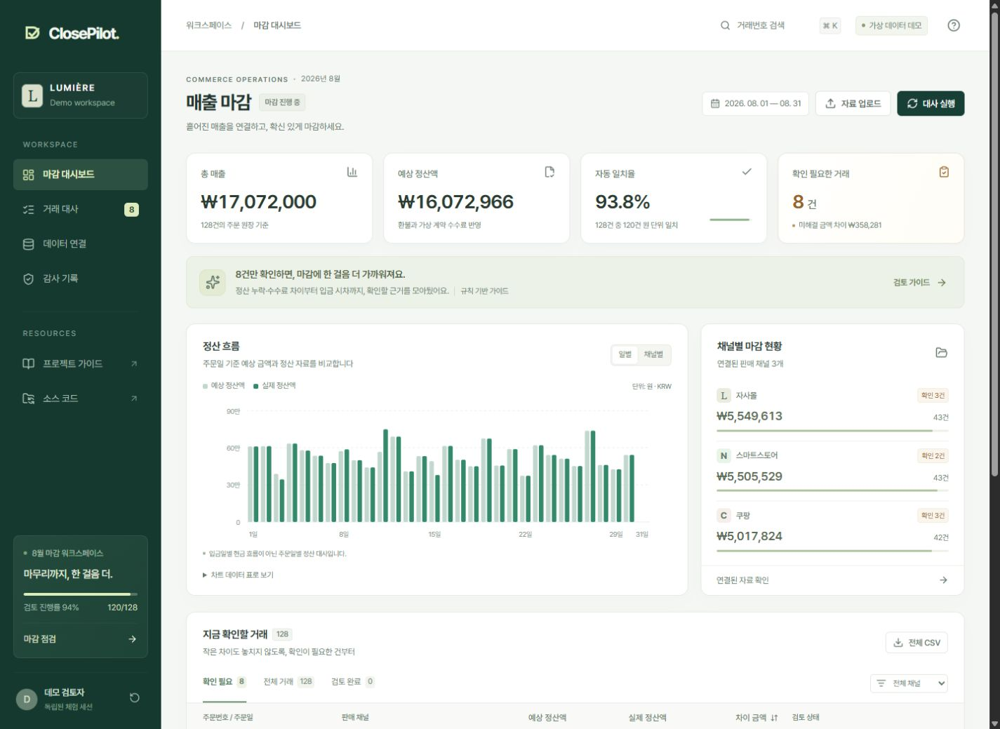

# ClosePilot

**흩어진 커머스 정산 자료를, 설명할 수 있는 월 마감으로.**

K-브랜드 재무 담당자가 주문과 정산 자료의 차이를 발견하고, 근거를 검토하고, 확정된 결과를 다시 검증할 수 있는 매출 마감 워크벤치입니다.

[공개 데모](https://closepilot-delta.vercel.app) · [제품 가이드](https://closepilot-delta.vercel.app/guide) · [설계 기록](docs/architecture.md) · [검증 근거](docs/verification.md)



> PortOne Commerce Ops Product Engineer 지원을 위해 기획·설계·구현·검증·배포한 개인 포트폴리오입니다. PortOne 공식 제품이나 제휴 서비스가 아닙니다. 모든 브랜드·주문·계약 수수료는 가상이며, 실제 고객 인터뷰·도입 성과·결제·송금은 없습니다. 공개 화면의 검토 가이드는 **규칙 기반이며 LLM을 호출하지 않습니다.**

## 왜 이 문제인가

월 마감의 마지막 단계는 합계를 구하는 것보다 **“왜 이 거래가 다르고, 어떤 근거로 처리했는지”를 설명하는 일**이라고 가정했습니다. 채널마다 다른 CSV, 부분 환불, 수수료, 중복 정산, 입금 시차를 하나의 화면에서 추적하는 범위로 문제를 좁혔습니다.

가상의 K-Beauty 브랜드 **LUMIÈRE**를 설정하고, 자사몰·스마트스토어·쿠팡 형식의 주문/정산 샘플을 직접 생성했습니다. 현장 인터뷰를 한 것처럼 쓰지 않고, 확인해야 할 질문과 온보딩 기준을 [제품 기획서](docs/product-brief.md)에 분리했습니다.

| 지원 직무의 기대            | 이 프로젝트에서 확인할 수 있는 작업                                     |
| --------------------------- | ----------------------------------------------------------------------- |
| 모호한 운영 문제 정의       | 가설, 인터뷰 질문, 입력 계약, 완료 조건, 미해결 위험 명시               |
| 온보딩 → 구현 → 배포 완결   | CSV 매핑/미리보기 → 원자적 반영 → 대사 → 검토 → 마감 → Vercel 배포      |
| 타입으로 도메인 복잡도 통제 | TypeScript 경계 검증, 정수 KRW 연산, Kotlin 값 클래스·sealed 결과 타입  |
| 재사용 가능한 제품 자산     | CSV 어댑터, 순수 대사 함수, 명령 처리기, 독립 검증기, 골든 데이터       |
| 안정적인 현장 운영          | 중복 요청·동시 수정 방어, DB 잠금, 감사 기록, 오류 추적, 운영 가이드    |
| AI를 개발 과정에 통합       | Codex로 구현·검증하고, AGENTS/Claude 지침·검증 훅·CI에 변경 규칙을 고정 |

## 3분 체험

1. 대시보드에서 **128건 중 일치 120건, 확인 필요 8건**을 확인합니다.
2. `LM-2608045` 중복 정산 거래를 엽니다. 정산 원본 두 행과 예상/실제 금액을 비교합니다.
3. **데모 검토 예시**를 불러오고 근거 확인 체크 후 승인합니다. 미검토 건수는 줄지만 원본 금액과 자동 일치율은 변하지 않습니다.
4. **자료 업로드**에서 주문·정산 샘플을 각각 미리 보고 반영합니다. 새로운 자료가 있으면 재대사 전 승인이 막힙니다.
5. 나머지 예외를 검토한 뒤 **마감 점검 → 마감 확정**을 실행합니다. JSON 패키지를 내려받아 Kotlin 검증기로 다시 계산할 수 있습니다.

독립된 6시간 데모 세션이 자동 생성됩니다. 실데이터·개인정보를 올리지 마세요. [자세한 시연 순서](docs/demo-script.md)

## 구현한 핵심

### 1. 차이를 숨기지 않는 대사

`(channel, orderId)`로 주문과 정산을 연결합니다. KRW 정수와 basis points를 사용하고 수수료는 **환불 차감 후 주문별 반올림**합니다. 같은 채널의 중복 정산 ID는 자동 제거하지 않습니다.

정산 누락, 주문 미확인, 중복, 환불, 수수료, 금액 불일치, 입금 시차의 **7개 예외 유형**을 지원합니다. 여러 조건이 겹치면 고정 우선순위로 대표 예외 하나를 표시하며, 모든 원본 정산 행은 남깁니다. 실제 채널의 계약·입금 API를 구현한 것은 아닙니다.

### 2. 근거를 남기는 명령 처리

`import → reconcile → resolve → close`를 명령으로 처리합니다. `expectedVersion`, `SELECT ... FOR UPDATE`, `Idempotency-Key`를 함께 사용합니다. 상태·승인 기록·감사 이벤트·재시도 영수증이 하나의 트랜잭션에서 커밋됩니다.

승인은 금액 보정이나 회계 전표 생성이 아닙니다. 검토 사유와 증빙 식별자를 남기는 행위입니다. 원본이 바뀌면 해당 행의 fingerprint가 달라져 이전 승인을 그대로 사용할 수 없습니다. 마감 후에는 API와 DB 트리거 모두 수정 요청을 거부합니다.

### 3. Kotlin으로 독립 재검증

[Kotlin/JVM 모듈](verifier)은 웹 코드의 계산 결과를 그대로 신뢰하지 않습니다. 내보낸 패키지의 정규화된 주문·정산 입력에서 대사를 다시 수행하고, 행별 금액·분류·합계·승인 근거·감사 해시를 검사합니다.

`Won`, `BasisPoints`, `OrderKey` 값 객체와 `Reconciliation` sealed 결과를 사용합니다. 금액 계산은 `Long`/`BigInteger` 기반입니다. **웹 백엔드는 TypeScript/Next.js이며, Kotlin은 별도의 오프라인 검증 CLI입니다.** Kotlin 서버를 운영한 것처럼 표현하지 않습니다.

### 4. 온보딩과 운영까지 연결

CSV BOM/CRLF/따옴표 처리, 한글·영문 열 매핑, 숫자·날짜·기간 검증, 파일 중복 방지, 입력 한도, CSV 수식 주입 방어를 구현했습니다. 상태는 PostgreSQL에 저장하며 메모리 목업으로 배포하지 않습니다. 운영 런타임에 DB 설정이 없으면 명시적으로 실패합니다.

## 구조와 기술 선택


| 영역      | 선택                                                                   |
| --------- | ---------------------------------------------------------------------- |
| 웹/REST   | Next.js 16, React 19, TypeScript strict, Zod                           |
| 도메인    | 프레임워크에 의존하지 않는 대사 함수, 레이어 경계 검사                 |
| DB        | 운영: Neon PostgreSQL / 로컬: PGlite / CI: PostgreSQL 17               |
| 독립 검증 | Kotlin 2.4.10, JVM 21, Gradle Wrapper 9.4.1                            |
| UI        | 자체 CSS, Pretendard, Lucide, 반응형 화면·키보드 대화상자              |
| 검증/배포 | Vitest, 실제 HTTP 검증 스크립트, Kotlin 테스트, GitHub Actions, Vercel |

작은 데모의 배포·운영 복잡도를 줄이기 위해 TypeScript 웹 런타임을 선택했습니다. 데이터는 한 세션의 제한된 마감 aggregate를 JSONB로 저장합니다. 대규모 거래 처리에는 정규화 테이블·비동기 작업·별도 마이그레이션 실행이 필요합니다. [설계와 대안](docs/architecture.md) · [ADR](docs/adr/0001-runtime-and-scope.md)

## 데이터와 검증

아래 수치는 **의도적으로 만든 고정 샘플의 결과**입니다. 업무 시간 절감, 실제 자동화율, 실서비스 성능을 측정한 값이 아닙니다.

| 고정 샘플           |          값 |
| ------------------- | ----------: |
| 주문 / 정산 행      |   128 / 127 |
| 원 단위 일치 / 예외 |     120 / 8 |
| 일치율              |       93.8% |
| 주문 총액           | ₩17,072,000 |
| 예상 순정산액       | ₩16,072,966 |
| 예외별 절대 차이 합 |    ₩358,281 |

예외 8건은 누락 2, 수수료 2, 환불 1, 중복 1, 시차 2입니다. 시차 2건의 차이 금액은 0원이며, 입금 필드/예정일로 분류합니다. 예외별 절대 차이 합은 순차액 또는 회수 가능한 금액을 뜻하지 않습니다.

- TypeScript **77개 테스트**: 금액, CSV, 도메인 상태, HTTP 보안, DB 트랜잭션·동시성·세션 격리.
- Kotlin **6개 테스트**: 고정 패키지 재계산, 중복, 체크섬·계산값·감사 기록 변조 거부.
- HTTP **20개 검증 단계**: 실제 서버에서 세션 생성부터 CSV 반영·예외 승인·마감·내보내기까지.
- 브라우저 확인과 배포 결과는 [검증 기록](docs/verification.md)에 환경과 한계를 함께 기록합니다.

## 로컬 실행

Node.js 24 권장. **웹 데모만 실행할 때는 DB 계정이나 API 키가 필요 없습니다.**

```bash
npm ci
npm run dev
# http://localhost:3000
```

`DATABASE_URL`이 없으면 `.data/closepilot`에 PGlite 데이터를 저장합니다. PostgreSQL 사용 시 `.env.example`을 참고해 서버 환경 변수로 연결 문자열을 설정하세요. 브라우저 코드에 비밀키를 넣지 않습니다.

```bash
npm run verify                     # 레이어 검사, 타입, lint, 77개 테스트, 빌드
npm run fixtures                   # 고정 데이터와 검증 패키지 재생성
npm run smoke -- http://localhost:3000
```

Kotlin 독립 검증에는 JDK 21이 필요합니다. 첫 실행은 Gradle·의존성을 다운로드합니다.

```bash
cd verifier
bash gradlew test run --args='../fixtures/closed-package.json'
# 실제로 내려받은 패키지:
bash gradlew run --args='/absolute/path/to/closepilot-2026-08-close.json'
```

Windows에서는 `JAVA_HOME`을 JDK 21로 설정하고 루트에서 `./scripts/verify-kotlin.ps1`을 실행합니다. 한글 경로에서 Gradle 테스트 작업자의 classpath가 깨지는 문제를 피하도록 임시 ASCII 빌드 경로를 사용합니다.

Docker 설정도 제공합니다: `docker compose up --build`. 이 환경에서는 Docker 실행을 검증하지 않았습니다. GitHub Actions의 웹 검증은 별도의 PostgreSQL 서비스에서 수행하도록 구성했습니다.

## AI 사용과 재현 가능한 개발

이 프로젝트는 **Codex의 도움으로 기획·구현·브라우저 조작·테스트·배포**를 진행했습니다. 생성된 코드를 금융 계산의 근거로 삼지 않고, 명시적인 불변식·고정 입력·독립 Kotlin 재계산으로 확인했습니다.

- [AGENTS.md](AGENTS.md), [CLAUDE.md](CLAUDE.md): 에이전트가 지켜야 할 도메인·보안·검증 계약.
- [레이어 검사](scripts/check-architecture.mjs): 서버 코드를 클라이언트로 가져오거나 도메인에 DB 의존성을 추가하면 실패.
- [pre-commit 훅](.githooks/pre-commit): `git config core.hooksPath .githooks`로 활성화. CI에서도 같은 검증 실행.
- [변경 검토 절차](docs/ai-development.md): 근거 확인 → 제한된 변경 → 반례 검증 → 결과 기록.

공개 제품에 유료 LLM 호출이나 자율 승인 에이전트는 연결하지 않았습니다. 향후 설명 보조에 추가하더라도 금액·승인·마감 권한은 주지 않는 설계를 문서화했습니다.

## 범위와 남은 위험

이 결과물은 **작동하는 포트폴리오 데모**이며 기업용 재무 SaaS의 운영 준비를 마쳤다는 의미가 아닙니다. SSO/RBAC, 작성자·승인자 분리, 실채널·은행 검증, 다통화, 회계 전표, 외부 감사 서명/보관, SLA·복구 훈련은 범위 밖입니다. 증빙 식별자는 텍스트 기록이며 외부 증빙의 진위까지 확인하지 않습니다.

6시간 이후 세션 접근은 거부됩니다. 물리적 삭제는 다음 세션 생성 시 수행되는 지연 정리이며 정확히 6시간 뒤 삭제를 보장하지 않습니다. SHA-256은 체크섬이지 전자서명이나 DB 관리자에 대한 변조 방지 장치가 아닙니다. [보안 모델](docs/security.md) · [운영 가이드](docs/runbook.md) · [API 계약](docs/openapi.yaml)

## 참고 자료와 라이선스

도메인과 통신 설계의 참고 자료: [PortOne V2 REST API](https://developers.portone.io/api/rest-v2), [PortOne 파트너 정산 서비스 가이드](https://help.portone.io/content/partner_settlement_service_guide), [PostgreSQL 행 잠금](https://www.postgresql.org/docs/17/explicit-locking.html), [Next.js Route Handlers](https://nextjs.org/docs/app/getting-started/route-handlers). 실제 서비스 정책을 복제하거나 공식 연동을 주장하지 않습니다.

코드: [MIT](LICENSE). Pretendard: [SIL Open Font License](public/fonts/OFL.txt). 채널명은 시나리오 설명을 위한 표시이며 로고·공식 에셋은 사용하지 않았습니다.
