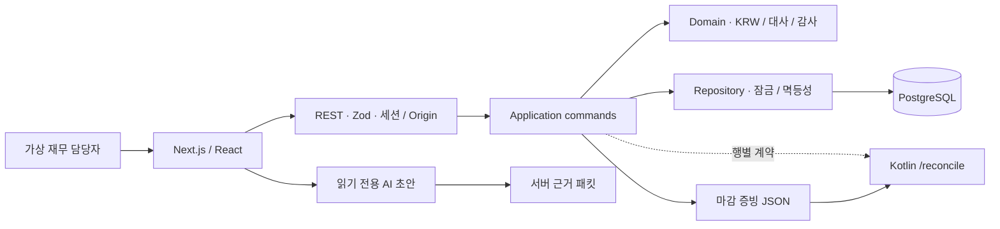

# ClosePilot

[](https://github.com/kwakhyun/closepilot/actions/workflows/verify.yml)

주문 자료와 판매 채널의 정산 자료를 대조해 예외 거래의 검토 근거를 기록하고, 확정한 마감 결과를 보관하는 커머스 매출 마감 도구입니다.

**바로 보기:** [공개 데모](https://closepilot-delta.vercel.app), [완료된 합성 예시](https://closepilot-delta.vercel.app/?showcase=completed), [제품 가이드](https://closepilot-delta.vercel.app/guide)

**문서:** [설계 기록](docs/architecture.md), [검증 근거](docs/verification.md)


> B2B 커머스 운영 문제를 다루는 FDE/Product Engineer 역할을 가정해 만든 개인 포트폴리오입니다. 브랜드, 거래, 수수료율은 모두 합성이며 고객 인터뷰나 도입 성과 측정은 진행하지 않았습니다. 실제 결제, 송금, 회계 전표 생성 기능은 없습니다. AI는 저장된 합성 근거로 검토 메모 초안만 만들며 금액을 바꾸거나 거래를 승인하고 마감할 권한이 없습니다.

## 90초 검토 경로

1. [거래 대사 화면](https://closepilot-delta.vercel.app/?view=transactions)에서 `LM-2608045`를 열고 중복된 정산 두 행, 예상 정산액, 자료상 정산액을 비교합니다.
2. **검토 예시 불러오기**를 누르고 원본 확인란을 체크한 뒤 기록합니다. 원본 금액과 자동 일치 결과는 유지되고 사유와 증빙 참조만 저장됩니다.
3. [완료된 합성 예시](https://closepilot-delta.vercel.app/?showcase=completed)에서 읽기 전용 상태, 감사 기록과 마감 증빙 JSON을 확인합니다.

자료 반영부터 모든 예외 거래의 검토와 마감까지 직접 실행하려면 [전체 시연 순서](docs/demo-script.md)를 참고하세요. 방문자별 데모 세션은 6시간 동안 접근할 수 있습니다. 실제 거래 자료나 개인정보는 업로드하지 마세요.

## 문제 가설과 구현 근거

월 마감에서는 합계를 맞추는 것뿐 아니라 “왜 금액이 다르고, 어떤 근거로 검토했는가”를 설명해야 한다고 가정했습니다. 채널마다 다른 CSV를 표준화하고 부분 환불, 수수료 차이, 중복 정산, 입금 시점 차이를 검토하는 범위로 문제를 좁혔습니다.

| 확인할 역량                               | 저장소의 구현 근거                                                              |
| ----------------------------------------- | ------------------------------------------------------------------------------- |
| 모호한 운영 문제를 구현 범위로 전환       | 문제 가설, 확인 질문, 입력 규칙, 완료 기준, 실제 도입 전 확인 항목              |
| 온보딩부터 배포까지 이어지는 구현         | 버전형 고객 프로필, CSV 열 연결, 대사, 검토, 마감, 공개 데모                    |
| 도메인 복잡도를 타입과 규칙으로 통제      | 원 단위 정수, BigInt 중간 계산, Kotlin 값 객체와 sealed 결과, 상태 불변식       |
| 고객별 설정을 재사용 가능한 기능으로 분리 | 프로필 복제, 채널별 요율, 열 연결 저장, TypeScript/Kotlin 공통 계약 검증 데이터 |
| 운영 중 실패를 고려한 설계                | 행 잠금, 버전 검사, 멱등 요청, 감사 기록, 마감 후 변경 차단, 운영 문서          |
| AI를 제한된 제품 흐름에 적용              | 읽기 전용 근거 묶음, 구조화 출력, 인용과 금액·날짜·권한 검증, 규칙 기반 전환    |

아직 실제 고객 인터뷰는 진행하지 않았습니다. [고객 인터뷰 기록 템플릿](docs/discovery-notes.md)은 인터뷰에서 확인한 사실과 제품 가설을 구분해 기록하기 위한 문서입니다.

## 핵심 설계

- `(channel, orderId)`를 주문 키로 사용합니다. 수수료는 환불액을 차감한 금액에 프로필 요율을 적용하고 주문별로 반올림합니다.
- 정산 누락, 주문 미확인, 중복, 환불액, 수수료, 금액, 입금 시점의 7가지 예외를 분류하되 모든 원본 행을 보존합니다.
- `import → reconcile → resolve → close`를 명령으로 처리합니다. 새 자료는 재대사 전에 승인할 수 없고, 결과 식별값(fingerprint)이 바뀌면 이전 승인도 무효가 됩니다.
- 상태와 감사 이벤트, 요청 처리 기록(receipt)은 한 트랜잭션에 저장합니다. 확정 후 변경은 애플리케이션과 DB 트리거가 함께 거부합니다.
- Kotlin `/reconcile` 응답은 TypeScript가 만든 행별 계약 검증 데이터와 비교하고, `/verify`는 마감 패키지의 계산값과 감사 해시를 다시 검사합니다.
- AI 검토 초안은 서버가 만든 근거 묶음(evidence packet)만 읽습니다. 허용되지 않은 인용, 금액, 날짜 또는 완료 단정이 있으면 결과를 폐기하고 규칙 기반 초안으로 전환합니다.



| 영역      | 선택                                                 |
| --------- | ---------------------------------------------------- |
| 웹        | Next.js 16, React 19, TypeScript strict, Zod         |
| 데이터    | PostgreSQL/Neon, 로컬 PGlite                         |
| 독립 검증 | Kotlin 2.4.10, JVM 21, Gradle 9.4.1                  |
| AI        | Vercel AI SDK, OpenAI Responses API, Zod 구조화 출력 |
| 검증      | Vitest, Playwright, 실제 HTTP smoke, GitHub Actions  |

자세한 내용은 [아키텍처와 대안](docs/architecture.md), [런타임 ADR](docs/adr/0001-runtime-and-scope.md), [API 명세](docs/openapi.yaml), [Kotlin 계약](docs/kotlin-openapi.yaml)에서 확인할 수 있습니다.

## 고정 샘플과 검증

아래 수치는 직접 만든 고정 샘플 결과이며 업무 시간 절감이나 실서비스 자동화율이 아닙니다.

| 고정 샘플               |                        값 |
| ----------------------- | ------------------------: |
| 주문 / 정산 행          |                 128 / 127 |
| 자동 일치 / 예외 거래   |                   120 / 8 |
| 자동 일치율             |                     93.8% |
| 주문 총액 / 예상 정산액 | ₩17,072,000 / ₩16,072,966 |
| 예외 차액 절댓값 합계   |                  ₩358,281 |

- Vitest 12개 파일, TypeScript 테스트 121개
- 지정한 domain/application/http/repository 범위의 커버리지: statements 91.56%, branches 84.86%, functions 92.96%, lines 91.95%
- Playwright 7개: 모바일, 접근 가능한 대화상자, AI 승인 경계, 자료 반영부터 마감 다운로드까지 전체 흐름, 완료형 예시
- Kotlin 테스트 10개: `/reconcile`, TypeScript 행별 계약 비교, `/verify`, 패키지·체크섬·감사 변조 거부
- 실행 중인 서버를 대상으로 한 HTTP smoke 20단계와 PostgreSQL 17 CI

현재 실행 결과와 환경은 [검증 현황](docs/verification.md)에, 과거 결과는 [검증 이력](docs/verification-history.md)에 분리했습니다.

## 로컬 실행

Node.js 24를 기준으로 검증했습니다. 기본 대사 흐름에는 DB 계정이나 API 키가 필요 없습니다.

```bash
npm ci
npm run dev
# http://localhost:3000
```

`DATABASE_URL`이 없으면 `.data/closepilot`의 PGlite를 사용합니다. AI 초안을 실제 모델로 생성하려면 서버의 `OPENAI_API_KEY`가 필요합니다.

```bash
npm run verify
npm run test:coverage
npm run test:e2e
npm run fixtures
npm run smoke -- http://localhost:3000
```

Kotlin 검증에는 JDK 21이 필요합니다.

```bash
cd verifier
bash gradlew test run --args='../fixtures/closed-package.json'
bash gradlew run --args='--server 8081'
```

Windows에서는 루트의 `scripts/verify-kotlin.ps1`을 사용합니다. Docker 설정도 제공하지만 이 작업 환경에서 Docker 실행은 검증하지 않았습니다.

## 범위와 남은 위험

이 결과물은 작동하는 포트폴리오 데모이며 기업용 재무 SaaS의 운영 준비가 끝났다는 뜻이 아닙니다. 다음 항목은 구현하거나 검증하지 않았습니다.

- 실제 고객 인터뷰와 PG, 판매 채널, 은행, 회계 시스템 연동
- SSO/RBAC, 작성자와 승인자 분리, 엔터프라이즈 접근 통제
- 여러 통화, 회계 전표, 외부 감사용 전자서명과 장기 보관
- 대규모·장시간 부하, 장애 주입, Kubernetes 운영, SLA와 복구 훈련

세션 토큰은 엔터프라이즈 사용자 계정이 아닌 불투명 bearer capability입니다. SHA-256은 내용 무결성 확인용이며 서명이나 DB 관리자 방어 수단이 아닙니다. 자세한 내용은 [보안 모델](docs/security.md), [운영 가이드](docs/runbook.md), [AI 개발 원칙](docs/ai-development.md)을 참고하세요.

## 라이선스

코드는 [MIT](LICENSE), Pretendard는 [SIL Open Font License](public/fonts/OFL.txt)입니다. 채널명은 합성 시나리오 설명을 위한 표시이며 공식 로고나 에셋은 사용하지 않았습니다.
