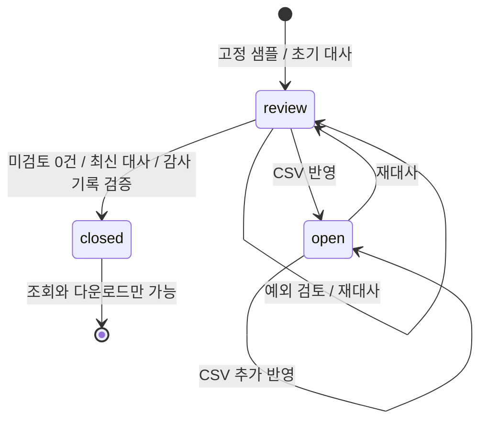

# 아키텍처와 설계 결정

## 경계

`src/domain`은 금액 계산, CSV 표준화, 대사, 감사 기록의 해시를 정의하며 DB·Next.js·React에 의존하지 않는다. `src/application`은 자료 반영, 대사, 검토 승인, 마감 확정 명령에 따른 상태 변경과 검토 정책을 처리한다. `src/infrastructure`는 PostgreSQL 저장소, 세션, HTTP 요청 처리를 담당한다. Route Handler는 요청을 검증하고 처리 결과를 응답으로 변환한다.

공개 웹 앱은 Vercel에 배포하며 서버 코드는 TypeScript로 구현했다. `verifier/`의 Kotlin/JVM 모듈은 주문·정산·프로필 요율을 받는 `POST /reconcile` 대사 유스케이스와 마감 패키지를 검증하는 CLI와 `POST /verify`를 제공한다. 로컬과 CI에서는 실제 HTTP 경계를 실행한다. 공개 Vercel 배포는 JVM을 호스팅하지 않아 TypeScript 인프로세스 대사 함수를 사용한다. 클라이언트 코드는 application 계층의 타입만 `import type`으로 참조한다. `npm run check:architecture`는 이 의존성 규칙을 검사한다. 정적 import 문을 대상으로 하므로 모든 간접 의존성을 추적하는 검사는 아니다.

프런트엔드는 세션·명령 호출을 `useWorkspaceSession`에 모으고, 대시보드 조합, 내비게이션, 요약·거래 화면을 별도 컴포넌트로 나눈다. `showcase=completed`는 application 계층이 동일한 공개 명령을 순서대로 적용해 미리 완료한 합성 작업공간을 만든다. 별도 우회 상태를 주입하지 않으며 생성 후에는 일반 마감과 같은 변경 불가 규칙이 적용된다.

`workspaceView`는 저장 객체를 펼쳐 반환하지 않고 화면 응답 필드를 명시한다. `close`에는 `hash`, `closedAt`, `closedBy`만 포함한다. 전체 입력, 대사 행과 승인 근거를 가진 마감 패키지는 저장 상태에 그대로 유지하며 `/api/export?format=json`으로 제공한다. 이 조회 계약 변경은 승인 지문이나 마감 패키지 형식을 변경하지 않는다.

새 세션을 만들 때 클라이언트의 `sessionRevision` 값을 증가시켜 자료 가져오기 대화상자, 거래 검토 서랍과 마감 대화상자를 다시 생성한다. 같은 프로필이나 같은 버전 번호로 새 데모를 시작해도 이전 CSV 검증 결과를 재사용하지 않는다. 컴포넌트가 제거될 때 검증 요청을 취소하고 요청 번호를 무효화해 늦은 응답과 파일 읽기가 새 상태에 반영되지 않게 한다. 규칙 기반 분석 요청도 세션 전환 시 취소한다.

차트 집계는 화면용 순수 함수 `trend-data.ts`에서 일별과 사용 채널별 합계를 한 번의 순회로 만든다. React는 행, 마감 월과 사용 채널이 바뀔 때만 다시 집계한다. 축은 양수, 음수와 영점을 포함하며 막대는 영점에서 각 값까지 그린다. 모바일에서는 안내와 거래 목록을 먼저 배치하고 요약 지표와 차트를 아래에 둔다. 별도 캐시 서버나 전역 상태 라이브러리는 추가하지 않는다.

## 금액과 대사

CSV 미리보기는 application의 `previewImport`에서 현재 상태의 복제본에 실제 반영 명령을 적용해 영향도를 계산한다. 저장소의 명령 실행은 호출하지 않으므로 상태, 감사와 receipt는 바뀌지 않는다. 응답의 `expectedVersion`으로 실제 반영을 요청하며, 사이에 자료가 바뀌면 기존 버전 검사로 거부한다. 행 검증은 잘못된 행마다 첫 오류의 행 번호, 필드와 메시지를 제공한다.

- 금액은 원 단위 정수로 처리한다. 개별 금액과 합계의 절댓값은 1조 원 이하여야 하며, 입력이 안전한 정수인지 검사한다.
- CSV 반영 명령은 저장 전에 조회와 동일한 합계 검증을 실행한다. 서로 다른 거래가 각각 한도 이내여도 전체 주문 총액, 환불액, 예상 정산액, 자료상 정산액, 순차액 또는 예외 차액의 절댓값 합계가 한도를 넘으면 트랜잭션 전체를 거부한다. 기존 규칙의 검증 시점을 앞당긴 변경이며 대사 행, 승인 지문과 마감 패키지 형식은 바꾸지 않는다.
- 수수료율은 작업공간에 고정한 온보딩 프로필에서 읽는다. LUMIÈRE 기본 프로필은 자사몰 3.3%, 스마트스토어 3.85%, 쿠팡 8.8%(330·385·880bps), MORROW FOODS 프로필은 자사몰 2.9%, 쿠팡 7.2%로 가정한다. 모두 합성 계약 조건이며, 환불액을 뺀 금액에 적용한 뒤 주문별로 반올림한다.
- `expectedFee = floor(((gross - refund) * bps + 5000) / 10000)`.
- `expectedNet = gross - refund - expectedFee`, `delta = actualNet - expectedNet`.
- TypeScript는 `BigInt`, Kotlin은 `BigInteger`로 중간 곱셈과 합계를 계산한다.
- `actualNet`은 정산 자료의 `net`을 합산한 값으로, 화면에서는 **자료상 정산액**이라고 표시한다. 은행 입금 내역을 조회한 결과가 아니다. 차트는 이 자료를 주문일별 또는 판매 채널별로 집계한다.

온보딩 프로필은 브랜드명, 산업, 마감 기간, 채널별 요율, 사용 채널, 열 연결, 검토 규칙, 가상 진단 결과와 로드맵을 버전 스냅샷으로 보관한다. CSV 반영 때 `saveMapping=true`이면 검증한 열 연결과 자료 반영이 하나의 명령과 트랜잭션으로 저장된다. 프로필을 바꾸거나 복제할 때는 새 세션과 새 합성 데이터를 만들므로 기존 작업공간의 승인 지문과 마감 패키지는 영향을 받지 않는다. 배포 전에 생성된 6시간 세션에는 프로필 필드가 없을 수 있어 기본 LUMIÈRE 프로필로 읽고, 다음 쓰기에서 명시적으로 저장한다.

주문 키는 `(channel, orderId)`다. 서로 다른 채널에서 같은 주문번호를 사용해도 충돌하지 않는다. 같은 키의 주문이 중복되면 파일 전체를 반영하지 않는다. 서로 다른 정산번호는 분할 정산으로 보고 합산하며, 같은 채널에서 정산번호가 반복되면 중복 정산으로 표시한다. 정산 내역이 없는 주문과 연결할 주문을 찾지 못한 정산 내역도 결과에 포함한다.

대표 유형의 우선순위는 **중복 정산 → 주문 미확인 → 정산 누락 → 환불액 차이 → 총액 차이 → 수수료 차이 → 정산액 차이 → 입금 확인 필요 → 일치**다. 총액과 정산액의 차이는 모두 `amount` 유형에 해당한다. 대표 유형은 하나로 유지하고, 거래 서랍의 `diagnoseRow`가 총액, 환불액, 수수료, 중복과 입금일을 별도로 진단한다. 이 표시용 진단은 저장 행과 fingerprint에 포함하지 않는다. `timing`은 입금일이 없거나 마감 기준일 이후인 경우이며, 화면에서는 **입금 확인 필요**로 표시한다.

## 읽기 전용 도구와 월 전환

`simulatePolicy`는 복제한 상태에 비교용 요율만 넣어 예상 결과와 승인 무효화 대상을 계산한다. 현재 설정에 적용하는 명령은 제공하지 않는다. 마감 후에도 실행할 수 있지만 원본 마감은 바뀌지 않는다.

`inspectPackage`는 최대 5,000,000바이트 JSON의 구조, 원본 스냅샷 해시, TypeScript 재계산, 승인 지문과 감사 연결을 검사한다. 유효한 패키지만 화면 목록에 추가하며 최대 12개를 메모리에 유지한다. 파일을 DB에 저장하거나 현재 작업에 반영하지 않는다. 같은 TypeScript 규칙을 사용하는 조회용 검사이며 독립 Kotlin 검증이나 전자서명을 대체하지 않는다.

새 월은 `period`(2020-01~2035-12)로 선택한다. 현재 설정을 같은 브랜드로 복제하는 경우 프로필 ID를 유지하되 기간과 월말 기준일을 바꾸고 새 합성 거래를 만든다. 이전 세션의 자료와 마감은 수정하지 않는다. 쿠키는 새 세션으로 바뀌므로 이전 마감 파일을 먼저 내려받아야 하며 계정 기반 월별 보관함이나 세션 복귀 기능은 없다. 증빙의 이월 검토 목록은 같은 프로필의 더 늦은 월에서 `(channel, orderId)`가 일치하는 정산 행 수를 보여 주는 참고 기능이다. 자동 이월이나 입금 확정은 수행하지 않는다.

## 탭별 임시 메모

조회 DTO의 `draftScope`와 `reviewFingerprints`로 세션별 임시 저장 키와 메모의 결과 버전을 구분한다. `draftScope`는 서버가 만든 비인증용 식별값이며 세션 토큰이 아니다. 메모는 `sessionStorage`에 저장하고 세션 생성 후 6시간의 만료 시각을 검사한다. 서버 승인이나 패키지에 포함하지 않으며 복원 시 확인란을 해제한다. 승인 성공 후 해당 메모를 제거한다. 새 필드는 기존 JSON 작업 상태에 저장하므로 SQL 스키마 변경은 없다.

## 상태와 승인

설정 복제 요청은 `cloneCurrent=true`, 새 브랜드명, `expectedVersion`을 받는다. 서버는 쿠키가 가리키는 원본 작업공간을 트랜잭션 안에서 잠그고 만료와 버전을 확인한 뒤, 저장된 프로필 전체를 복사한다. 클라이언트가 임의의 정책이나 열 연결을 주입할 수 없다. `clonedFrom`은 직접 복제한 원본 프로필 ID를 기록하고, 새 작업공간에는 해당 정책으로 만든 합성 거래와 초기 감사 기록만 생성한다.



검토 기록은 대사 결과의 식별 해시(SHA-256 fingerprint)와 연결한다. 자료가 바뀌어 결과가 달라지면 기존 승인은 유효하지 않다. 입금 확인이 필요한 거래에는 `carry_forward`(이월 검토 승인), 중복 정산에는 `exclude_duplicate`(중복 확인 승인), 나머지에는 `accepted_variance`(차이 검토 승인)만 허용한다. 승인은 검토 판단을 기록하는 기능이며 원본 금액이나 정산 행을 변경하지 않는다.

v1의 대사 결과에 포함된 `explanation` 문자열은 fingerprint 계산에도 사용된다. 문구를 고친다는 이유로 이 값을 바꾸면 기존 승인이 무효화될 수 있다. 따라서 화면과 검토 가이드의 설명은 `src/domain/review-copy.ts`에서 별도로 구성하고, 저장된 대사 결과·감사 기록·마감 증빙은 유지한다. 감사 화면의 처리 유형도 표시할 때만 한글로 바꾼다. [용어와 문구 기준](copy-guide.md)

## 트랜잭션과 멱등성

```mermaid
sequenceDiagram
  participant UI
  participant API
  participant DB as PostgreSQL
  UI->>API: command + expectedVersion + Idempotency-Key
  API->>API: Origin / session / Zod 검증
  API->>DB: BEGIN; SELECT workspace FOR UPDATE
  API->>DB: 기존 receipt 조회
  alt 같은 key와 payload
    DB-->>API: 최신 workspace; 재적용 없음
  else 신규 명령
    API->>API: 버전 / 도메인 불변식 검사
    API->>DB: 상태 + 이벤트 + receipt 저장
  end
  API->>DB: COMMIT
  API-->>UI: workspace + Idempotency-Replayed
```

같은 요청 키에 다른 본문을 보내면 HTTP 409를 반환한다. 키와 본문이 모두 같은 재시도에는 명령을 다시 적용하지 않고 **최신 작업 상태**를 반환한다. 최초 응답을 그대로 돌려주면 클라이언트가 오래된 상태로 되돌아갈 수 있기 때문이다. `expectedVersion`이 현재 버전과 다를 때도 409를 반환해 다른 변경을 덮어쓰지 않도록 한다. 프런트엔드는 최신 상태를 조회하고 충돌 안내를 표시한다.

## 저장 모델

| 테이블                         | 역할                                                           |
| ------------------------------ | -------------------------------------------------------------- |
| `closepilot_workspaces`        | 세션 해시 기본 키, JSONB 마감 데이터, 버전, 상태, 만료 시각    |
| `closepilot_receipts`          | 중복 요청 확인용 처리 이력: 세션·요청 키, 요청 해시, 적용 버전 |
| `closepilot_audit_events`      | 세션·순번별 감사 이벤트 사본                                   |
| `closepilot_rate_limits`       | 세션 생성 수와 AI 생성 시도 수를 별도 버킷으로 제한            |
| `closepilot_schema_migrations` | 런타임 마이그레이션 버전                                       |
| `closepilot_review_drafts`     | 세션별 AI 초안 캐시와 만료되는 실행 예약                       |

한 세션의 마감 데이터를 하나의 일관성 단위(aggregate)로 묶어 JSONB에 저장한다. 이 방식은 한 번의 변경을 원자적으로 처리하고 결과를 재현하기 쉽지만, 주문 500건·정산 1,000행·파일 12개·감사 이벤트 100개라는 제한을 전제로 한다. 변경할 때 전체 데이터를 다시 쓰고 세션별 행 잠금을 사용하므로 대량 거래나 여러 사용자의 동시 편집에는 적합하지 않다. 규모가 커지면 거래 테이블을 정규화하고 조회용 요약 데이터와 작업 큐를 분리해야 한다.

공개 배포는 Neon PostgreSQL을 사용하고, 로컬에서는 PostgreSQL 기반 내장 DB인 PGlite를 기본으로 사용한다. 파일을 저장할 디렉터리가 없으면 먼저 생성한다. Vercel에 `DATABASE_URL`이 설정되지 않았을 때는 오류를 반환한다. 마이그레이션의 중복 실행은 트랜잭션 범위 advisory lock과 버전 테이블로 제어한다. SQL은 [초기 스키마](../migrations/001_initial.sql), [JSONB 제약](../migrations/002_jsonb_guards.sql), [AI 초안 저장소](../migrations/003_review_drafts.sql)를 참고한다.

## AI 호출량과 캐시

마이그레이션 3은 검토 초안 전용 테이블을 추가한다. 명령 상태, 승인 기록과 마감 패키지에는 AI 실행 예약이나 캐시를 넣지 않는다. 키는 서버 근거 패킷, 모델명과 프롬프트 버전의 SHA-256이며 세션마다 분리한다. 같은 키의 성공한 초안을 재사용할 때도 현재 세션, 버전, 마감 상태, 미검토 대상과 인용 근거를 확인한다. 세션 삭제 시 캐시도 함께 삭제된다.

생성 예약과 사용량 차감은 한 트랜잭션에서 처리한다. 작업공간 행 잠금은 세션당 동시 1건을 보장하고, 공통 advisory lock은 전체 동시 4건 제한을 직렬화한다. 기존 사용량 테이블의 별도 `ai:` 버킷에서 UTC 기준 세션당 시간별 10회, 전체 일별 100회 생성 시도를 제한한다. 한도 거부 시 카운터 증가도 롤백하고, 이미 시작한 생성의 실패는 사용량에 포함한다. 캐시 조회와 API 키가 없는 요청은 생성 횟수를 차감하지 않는다.

예약은 45초 뒤 만료되며 모델 호출은 15초 안에 중단한다. 실패 시 예약을 해제하고, 프로세스 종료 등으로 정리하지 못하면 만료 후 재시도할 수 있다. 실행별 토큰을 검사해 이전 요청의 늦은 완료나 정리가 새 예약을 덮어쓰지 못하게 한다. 이 제한은 생성 시도 수를 제어하며 금액 기준의 과금 상한은 아니다. 한 생성은 최대 3단계, 단계별 출력 700토큰이며 SDK 자동 재시도는 끈다. 호출 제한이나 동시 실행 제한에 도달하면 HTTP 200의 `mode=rules` 응답과 이유를 반환한다.

## 감사와 독립 검증

JSONB 매개변수에는 JavaScript 객체를 전달하고 직렬화는 PostgreSQL 드라이버에 맡긴다. 공개 배포를 검사하면서 PGlite와 Postgres.js의 입력 처리 차이로 JSON이 두 번 직렬화되는 문제를 발견해 수정했다. 마이그레이션 2는 JSON 객체 형식과 필수 필드 제약을 추가한다. `NOT VALID`를 사용해 기존 행 전체를 소급 검사하지 않고 이후 쓰기에 제약을 적용했다. 따라서 과거의 모든 행을 검증했다는 의미는 아니다.

각 이벤트는 이전 이벤트의 해시를 포함한다. DB 트리거는 감사 기록과 마감이 확정된 작업 데이터의 `UPDATE`를 거부하지만, 만료된 세션을 정리하기 위한 `DELETE`는 허용한다. 테이블을 관리할 권한이 있으면 트리거를 변경하거나 기록 전체를 다시 만들 수 있다. 외부 전자서명, 공증, 변경이 불가능한 별도 보관소는 제공하지 않는다.

마감 증빙 JSON에는 표준 형식의 입력, 온보딩 프로필과 채널별 요율, 마감 기준일(`asOf`), 규칙 버전, 대사 결과, 유효한 검토 승인, 자료 체크섬(`digest`), 마감 해시, 감사 기록을 포함한다. 업로드한 CSV의 체크섬은 BOM과 줄바꿈을 정규화한 내용으로 계산한다. 초기 샘플의 체크섬은 생성한 표준 레코드로 계산하며 원본 CSV 파일의 바이트를 뜻하지 않는다. 원본 파일 자체는 저장하지 않는다.

Kotlin 대사 서비스는 같은 규칙 버전과 프로필 요율로 입력을 독립적으로 재계산한다. `/reconcile`은 행별 금액, 분류, 합계를 반환하고 `/verify`는 검토 승인이나 감사 기록이 맞지 않을 때 실패한다. 외부 계약의 정확성이나 증빙의 진위까지 보장하지는 않는다. 두 언어에 계산 규칙이 있으므로 `RULE_VERSION`을 변경할 때는 TypeScript와 Kotlin 구현, 고정 검증 데이터, [Kotlin OpenAPI 계약](kotlin-openapi.yaml)을 함께 갱신하고 반례 테스트를 추가해야 한다.

`fixtures/reconciliation-contract.json`은 TypeScript 대사 엔진이 만든 대표 행별 결과를 Kotlin `/reconcile` HTTP 테스트의 기대값으로 사용한다. 일치, 누락, 중복, 환불, 수수료, 입금 시점 유형과 합계를 한 계약으로 비교해 두 구현의 규칙 버전 또는 직렬화가 어긋나면 CI에서 실패한다. 이 고정 계약은 실제 채널 정책의 정확성을 증명하지 않으며, 합성 입력에 대한 언어 간 동등성만 검사한다.
