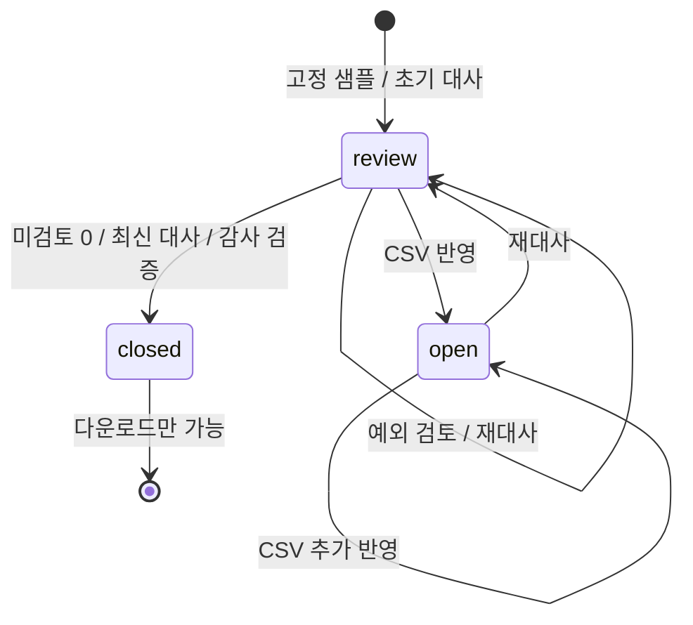

# 아키텍처와 도메인 결정

## 경계

`src/domain`은 금액, CSV 표준화, 대사, 감사 해시를 정의한다. DB·Next·React에 의존하지 않는다. `src/application`은 import/reconcile/resolve/close의 상태 전이와 검토 정책을 조합한다. `src/infrastructure`는 PostgreSQL, 세션, HTTP 경계를 맡는다. Route Handler는 요청 검증과 응답 변환만 연결한다.

웹 서버는 TypeScript다. `verifier/`의 Kotlin/JVM CLI는 외부 패키지 소비자이며 웹 요청 경로에 포함되지 않는다. 브라우저는 application 타입을 `import type`으로만 참조한다. `npm run check:architecture`가 현재 import 경계를 검사한다. 이 검사는 직접 import를 대상으로 하며 전체 정보 흐름의 형식 증명은 아니다.

## 금액과 대사

- KRW 정수, 개별/합계 절댓값 1조 원 한도. 입력에서 안전한 정수 여부를 검사한다.
- 가상 계약 요율: 자사몰 330bps, 스마트스토어 385bps, 쿠팡 880bps.
- `expectedFee = floor(((gross - refund) * bps + 5000) / 10000)`.
- `expectedNet = gross - refund - expectedFee`, `delta = actualNet - expectedNet`.
- TypeScript는 `BigInt`, Kotlin은 `BigInteger`로 중간 곱셈과 합계를 계산한다.
- 정산 자료의 `net`을 은행 입금으로 간주하지 않는다. 차트도 주문일별 정산 자료 비교다.

주문 키는 `(channel, orderId)`다. 서로 다른 채널의 같은 ID는 충돌하지 않는다. 주문 중복은 전체 import를 거부한다. 서로 다른 정산 ID는 분할 정산으로 합산하며, 같은 채널의 정산 ID가 반복되면 중복 예외를 표시한다. 정산 없는 주문과 주문 없는 정산도 남긴다.

대표 예외 우선순위: **중복 → 주문 미확인 → 정산 누락 → 환불 → 매출 금액 → 수수료 → 순정산액 → 입금 시차 → 일치**. 매출 금액과 순정산액은 같은 `amount` 유형이다. 복합 원인은 하나의 대표 분류만 표시하므로 연결된 정산 행을 함께 확인해야 한다.

## 상태와 승인



검토 기록은 거래 결과의 SHA-256 fingerprint에 귀속된다. 변경된 자료로 결과가 달라지면 기존 검토 기록을 유효 승인으로 취급하지 않는다. 입금 시차에는 `carry_forward`, 중복에는 `exclude_duplicate`, 나머지에는 `accepted_variance`만 허용한다. 승인은 숫자 덮어쓰기나 자료 삭제가 아니다.

## 트랜잭션과 멱등성

```mermaid
sequenceDiagram
  participant UI
  participant API
  participant DB as PostgreSQL
  UI->>API: command + expectedVersion + Idempotency-Key
  API->>API: Origin / session / Zod 검증
  API->>DB: BEGIN; SELECT workspace FOR UPDATE
  API->>DB: 기존 receipt 조회
  alt 같은 key와 payload
    DB-->>API: 최신 workspace; 재적용 없음
  else 신규 명령
    API->>API: 버전 / 도메인 불변식 검사
    API->>DB: 상태 + 이벤트 + receipt 저장
  end
  API->>DB: COMMIT
  API-->>UI: workspace + Idempotency-Replayed
```

같은 키로 다른 요청은 409다. 같은 키와 요청의 재시도는 **최초 HTTP 응답 복제 대신 최신 workspace**를 반환한다. 첫 응답을 잃은 클라이언트가 오래된 상태로 되돌아가지 않게 하는 명시적 계약이다. `expectedVersion`이 다르면 수정 손실을 막기 위해 409를 반환한다. 프런트엔드는 상태를 새로 읽고 오류를 표시한다.

## 저장 모델

| 테이블                         | 역할                                                 |
| ------------------------------ | ---------------------------------------------------- |
| `closepilot_workspaces`        | 세션 해시 PK, JSONB aggregate, 버전, 상태, 만료 시각 |
| `closepilot_receipts`          | 세션·요청 키의 유일성, 요청 해시, 적용 버전          |
| `closepilot_audit_events`      | 세션·순번별 감사 이벤트 사본                         |
| `closepilot_rate_limits`       | 시간/IP 해시 및 일일 전역 세션 생성 제한             |
| `closepilot_schema_migrations` | 런타임 마이그레이션 버전                             |

JSONB aggregate는 제한된 데모의 원자성/재현성을 단순하게 한다. 최대 주문 500, 정산 1,000행, 12개 파일, 감사 이벤트 100개라는 제한이 전제다. 변경 때 전체 aggregate를 다시 쓰고 행 잠금으로 세션 내 쓰기를 직렬화하므로 대량 거래/다수 공동 편집에 적합하지 않다. 정규화 거래 테이블, 요약 읽기 모델, 작업 큐는 확장 시 분리할 대상이다.

운영은 Neon PostgreSQL, 로컬 기본값은 같은 PostgreSQL 계열 엔진인 PGlite다. 파일 저장을 위한 부모 디렉터리를 명시적으로 생성한다. Vercel에서 `DATABASE_URL`이 없으면 로컬 저장소로 조용히 대체하지 않는다. 마이그레이션은 advisory transaction lock과 버전 테이블로 중복 실행을 제어한다. SQL은 [스키마](../migrations/001_initial.sql)를 참고한다.

## 감사와 독립 검증

JSONB 매개변수에는 직렬화된 문자열이 아니라 JS 객체를 전달한다. PostgreSQL 드라이버가 직렬화를 소유한다. PGlite와 Postgres.js의 입력 처리 차이 때문에 발생한 이중 인코딩을 공개 배포 검사에서 발견해 수정했다. 마이그레이션 2는 객체/필수 필드 제약을 추가한다. 기존 데모 행은 직접 수정하지 않고 신규 쓰기만 강제하는 `NOT VALID` 제약으로 전환했으므로, 모든 과거 행을 소급 검증했다는 뜻은 아니다.

이벤트는 이전 이벤트 해시를 포함한다. DB 트리거는 감사 행 UPDATE와 closed workspace UPDATE를 거부한다. 세션 만료 정리를 위한 DELETE는 허용한다. 일반 DB 권한을 가진 관리자는 트리거를 변경하거나 전체 기록을 다시 만들 수 있다. 이 데모는 외부 서명·공증·불변 보관소를 제공하지 않는다.

JSON 패키지에는 정규화된 입력, asOf, 규칙 버전, 각 결과, 유효 승인, 원본 digest, 마감 해시, 이벤트 체인을 포함한다. 업로드 digest는 BOM·개행을 정규화한 CSV 내용의 해시다. 초기 샘플의 digest는 생성된 정규화 레코드의 해시이며 실제 원본 CSV 바이트와의 동일성을 주장하지 않는다. 원본 파일 바이트 자체는 저장하지 않는다.

Kotlin 검증기는 동일 규칙 버전의 입력을 독립 재계산한다. 잘못된 행 금액·합계·분류·승인·감사 체인을 거부하지만 외부 계약의 정확성이나 증빙의 진위를 보장하지 않는다. 코드 두 곳에 규칙이 있으므로 `RULE_VERSION` 변경은 TypeScript·Kotlin·픽스처를 함께 갱신하고 반례 테스트를 추가해야 한다.
